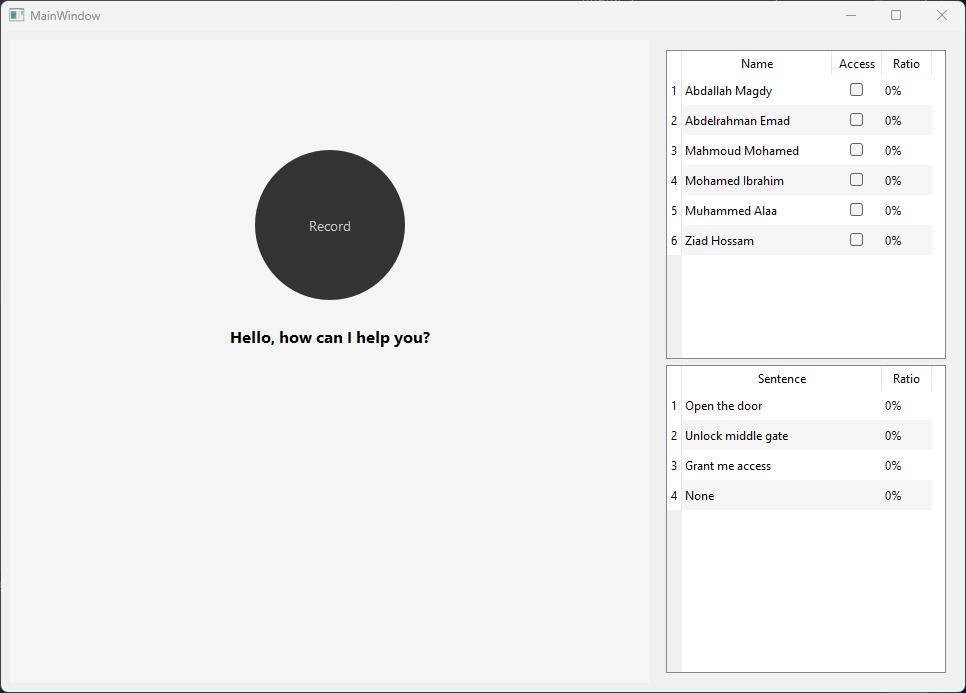
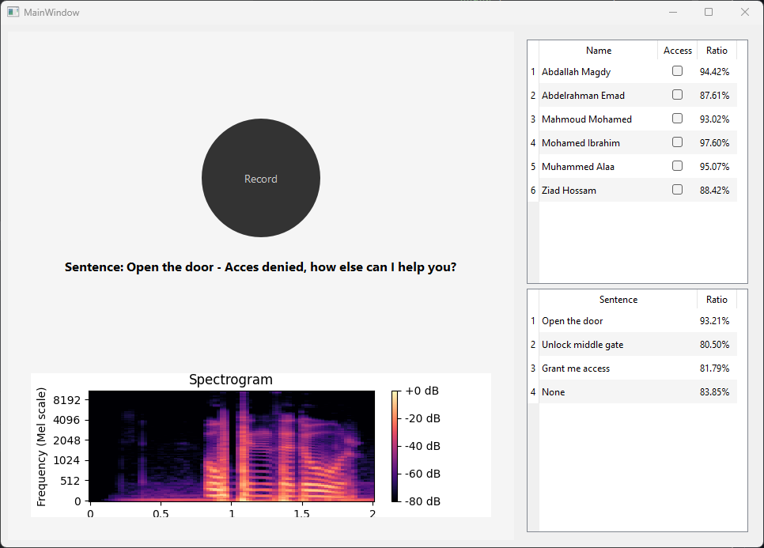
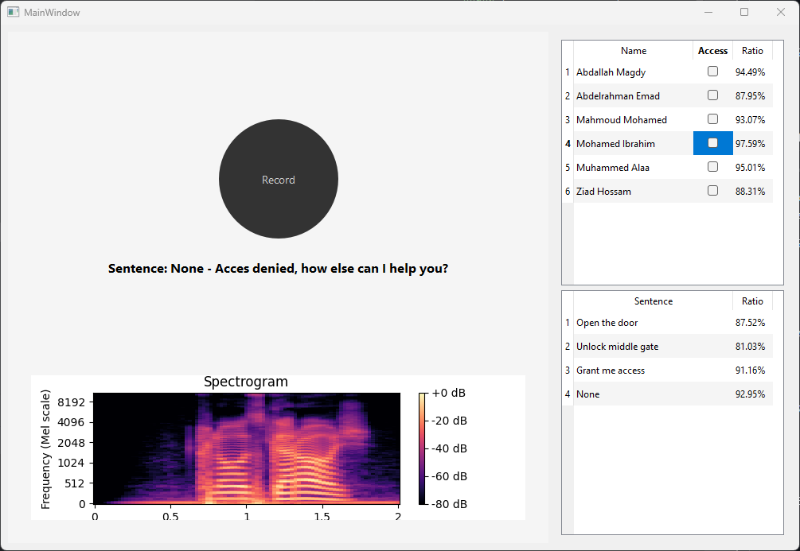
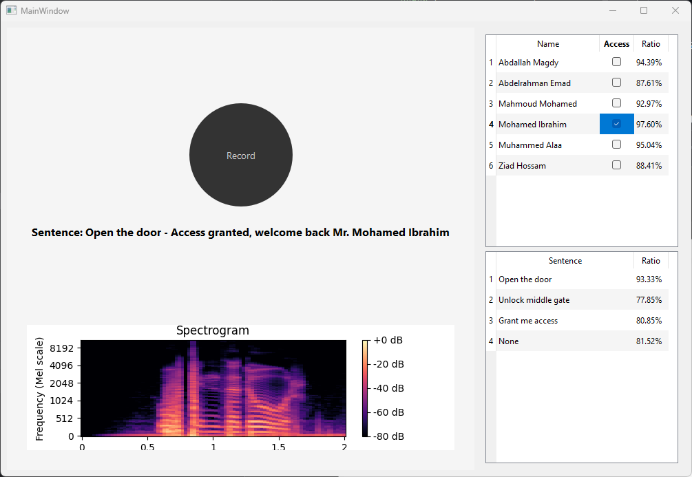

# Digiti Signum
___
Introducing "Digiti Signum," a dynamic backend solution meticulously crafted for robust Security Voice-code Access systems. 
This innovative software is engineered to ensure stringent access control, drawing upon advanced fingerprint and spectrogram concepts. 
Embracing two distinct operation modes, Digiti Signum sets a new benchmark in security protocol.    
Mode 1 - Security Voice Code, imposes a specific passcode sentence, fortifying access restrictions with unparalleled precision.    
Mode 2 - Security Voice Fingerprint, extends access to select individuals articulating the valid passcode sentence, 
offering customizable settings for identifying authorized users among the original eight.    
With its intuitive interface hosting essential components—voice-code recording, spectrogram viewing, and comprehensive 
analysis summary—Digiti Signum assures unequivocal communication of access outcomes, marking a paradigm shift in security verification.    
Trust Digiti Signum for cutting-edge security solutions, amalgamating technological prowess with intuitive user experience.

## Table of Content
___


## Introduction
___
Welcome to Digiti Signum, a comprehensive backend software devised for precise control and authentication in Security Voice-code Access systems. Harnessing advanced fingerprint and spectrogram methodologies, Digiti Signum serves as a foundational component, ensuring stringent verification of user access.

Operational in two key modes:

Mode 1 – Security Voice Code: Imposing a specific passcode sentence for access, setting a high bar for security.   
Mode 2 – Security Voice Fingerprint: Granting access based on authorized individuals articulating the valid passcode sentence. A customizable settings UI empowers the selection of eligible users among the original eight.   
The user interface boasts essential elements:   
a voice-code recording button, a spectrogram viewer exhibiting the spoken voice-code, and a comprehensive analysis summary. 
This summary meticulously details the similarity between spoken sentences and saved passcodes, along with matching the spoken voice with stored individuals.    
The software unequivocally communicates "Access gained" or "Access denied" based on the algorithm's outcomes.
Digiti Signum revolutionizes security paradigms by amalgamating state-of-the-art technology with an intuitive user experience. 
It emphasizes secure access control while prioritizing simplicity and reliability.

## Features
___

1. Mode Selection:
   - **Security Voice Code Mode:**
     - Recognizes specific passcode sentences for access control.
     - Allows customization of passcode sentences for enhanced security.
   
   - **Security Voice Fingerprint Mode:**
     - Grants access to authorized individuals based on voice recognition.
     - User interface for selecting and controlling access permissions for authorized users.

2. Voice Recognition & Analysis:
    - Extracts audio features using librosa for voice analysis.
    - Compares spoken passcodes with predefined phrases for access validation.

3. User Interface(UI) Elements:
   - Start Recording Button: Initiates voice recording for passcode analysis.
   - Spectrogram Viewer: Displays the spectrogram of the spoken voice-code.
   - Analysis Summary: Tables showing similarity scores between spoken sentences and saved passcodes and individuals.
   - Result Indicator: Displays "Access granted" or "Access denied" based on algorithm results.

4. Audio Feature Extraction:
   - Utilizes librosa for extracting various audio features:
        - Chroma feature, Spectral contrast, Zero-crossing rate, MFCCs, Spectrogram.

5. Voice Access Control:
   - Compares live audio spectrograms with stored passcode records.
   - Determines access based on similarity scores and predefined thresholds.

6. Security Enhancement:
   - Allows customization and addition of new passcode sentences and user records.
   - Provides flexibility in configuring access permissions and recognizing authorizid users.

7. PyQt-based UI:
    - Implements PyQt6 for a user-friendly interface and seamless interaction.
    - Streamlines controls for ease of use and efficient voice-based access control.

8. Adaptability & Use Cases:
   - Suitable for security applications requiring voice-based access control.
   - Offers adaptability for various fields including authentications and secure access scenarios.

## Getting started
___

1. Clone the repo to your local machine.
2. Install the necessary dependencies (PyQt, etc.) if not already installed
3. Run the app using ```Python main.py```
4. Start recording your voice and explore the application.

## User Interface
___
The Security Voice-code Access software offers an intuitive and user-friendly interface with the following key components:   

### Mode Selection:
  - Seamlessly switch between two operational modes:   
    - Security Voice Code Mode: Recognizes specific passcode sentences.   
    - Security Voice Fingerprint Mode: Grants access to authorized individuals based on voice recognition.   

### Voice Recording & Analysis:
  - Recording Buttons:
    - Initiate voice recording for passcode analysis with a single click.  

### Spectrogram Analysis:
  - Spectrogram Viewer:
    - Display and analyze the spectrogram of the spoken voice-code for comprehensive insights into the audio signal.

### Access Control & Indication:
  - Analysis Summary:
    - Tables presenting similarity scores between spoken sentences and saved passcodes.   
    - Tables illustrating similarity scores between the spoken voice and saved user records.   
  - Result Indicator:
    - Visual indicator displaying "Access granted" or "Access denied" based on algorithm results and access validation.   

## Usage
___

1. Initiate Voice Recording:
   - Click the designated button to start recording the voice-code for access validation.   

2. Visualize Spectrogram:
   - View and analyze the spectrogram of the recorded voice for a comprehensive understanding of the audio signal.   

3. Analyze Access Results:
   - Explore the analysis summary tables showcasing similarity scores between spoken sentences and saved passcodes.   
   - Interpret the results in the analysis summary tables displaying similarity scores between the spoken voice and saved user records.   

4. Access Validation Result:
   - Observe the displayed result indicator showcasing "Access granted" or "Access denied" based on the algorithm's evaluation.   

## Screenshots
___


_The UI of the Application at the start_


_If none of the users has access_


_If the phrase is not a granted one_


_If the user is granted and he said a right phrase_

Feel free to explore the application and discover its full potential for medical signal analysis.

## Contributers
___

We would like to acknowledge the following individuals for their contributions to the research:

<table>
  <tr>
    <td align="center">
    <a href="https://github.com/Bodykudo" target="_black">
    
    <br />
    <sub><b>Abdallah Magdy</b></sub></a>
    <td align="center">
    <a href="https://github.com/abduelrahmanemad" target="_black">
    
    <br />
    <sub><b>Abdelrahman Emad</b></sub></a>
    </td>
    </td>
    <td align="center">
    <a href="https://github.com/MohamedAlaaAli" target="_black">
    
    <br />
    <sub><b>Mohamed Alaa</b></sub></a>
    </td>
    <td align="center">
   <td align="">
    <a href="https://github.com/Medo072" target="_black">
    
    <br />
    <sub><b>Mohamed Ibrahim</b></sub></a>
    </td>
    </tr>
 </table>

---
We are confident that Digiti Signum will prove to be an indispensable asset for music producers, speech analysts, 
biomedical engineers, and enthusiasts alike in their pursuit of precise signal manipulation and analysis across diverse domains. Should you have any inquiries or face any challenges while using Digiti Signum, please feel free to contact us for assistance or clarification.
Wishing you a productive and fulfilling experience exploring the world of signal manipulation and analysis with Digiti Signum!

